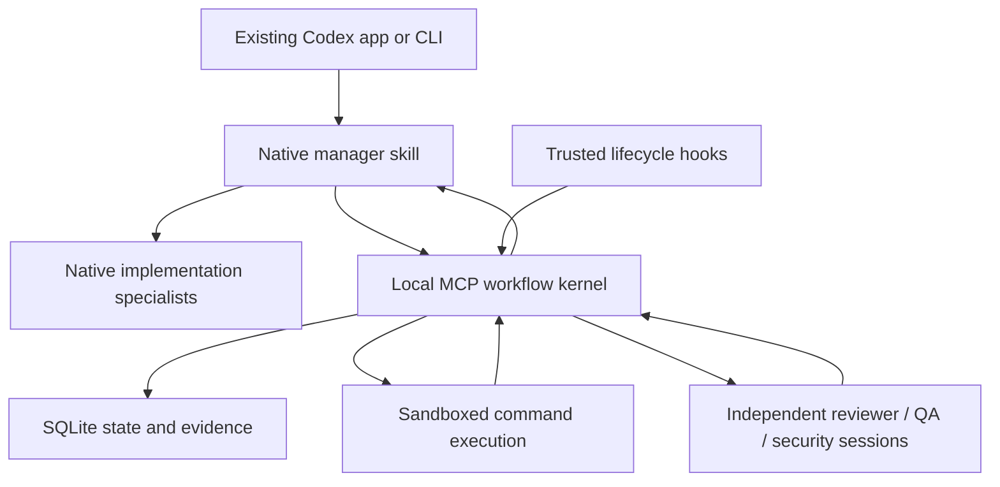

# DevGod replacement design

Date: 2026-09-12. Product direction is settled; the capability checks below block final implementation claims. This design supersedes unresolved product questions in the earlier research notes.

## Product contract

A software professional keeps using the existing Codex app or CLI. After intentional repository setup, substantive engineering requests activate a native manager workflow. The manager clarifies uncertain product decisions during design, delegates implementation, repairs failures, and continues autonomously. Normal completion is an implemented, verified local branch ready for human review.

The reported failures to fix are excessive permission requests and demands that the user manually repair DevGod's internal workflow. Creating tasks, recording checkpoints, dispatching reviews, reconciling state, and retrying recoverable failures are automatic internal work. Existing Codex permissions and actual external authorization requirements still apply. DevGod adds no permission ceremony for routine engineering.

Initial scope is one professional across local Git repositories, using existing Codex authentication. Publication, deployment, global configuration changes, shared infrastructure, and execution after Codex closes are outside the default delivery contract.

## Selected architecture

Use Python 3.12+, standard-library SQLite, the official `openai-codex` SDK, and a local stdio MCP service. Lock the SDK and its compatible runtime in distribution. Do not pin a model: native agents retain host settings; managed reviewers inherit the resolved user/repository default unless project configuration explicitly selects another model.

The native manager makes engineering judgments. The kernel computes deterministic next actions from the accepted task graph and observed results; it is not another model manager. SDK reviewers are separate Codex sessions, not native children in the host's subagent list. Their progress and findings appear through the manager and status tools.

Python fits the official supported adapter, transactional local storage, and small distribution. A permanent network daemon, PostgreSQL, semantic retrieval, dashboard, large role catalog, and independent conversation UI add no necessary capability to this release.

## Components and contracts

The package is `devgod`. Component ownership follows these boundaries; exact signatures are defined in [the implementation plan](implementation-plan.md).

| Module | Owns |
|---|---|
| `models.py`, `store.py` | Typed records, validated transitions, SQLite transactions, claims, migrations, event history. |
| `workspace.py` | Repository identity, branch/baseline capture, candidate digests, isolated snapshots, scope comparison. |
| `codex_adapter.py`, `launcher.py` | Supported SDK/protocol execution, sandbox policy, owned process supervision, interruption, structured review output. |
| `verification.py` | Actual check/reviewer dispatch, bounded jobs, receipts, freshness, and final gate evaluation. |
| `service.py` | Start/plan/checkpoint/status/next/verify/resume/recover/cancel operations and bounded diagnostic reports. |
| `mcp_server.py`, `cli.py` | Native tool interface; installation, doctor, status, and removal commands. |
| `install.py`, `hooks.py` | Small managed repository integration and supported lifecycle callbacks. |

Plans contain acceptance criteria, task dependencies, specialist roles, write scopes, and verification commands. Commands are argv arrays with bounded working directories and timeouts. Results identify the originating invocation, candidate and check-spec digests, artifacts, findings, and next actions. A model result cannot grant a state transition directly.

## Consuming-repository experience

Setup installs one manager skill, a small marked `AGENTS.md` section, and the necessary local MCP/hook configuration. Preserve preexisting instructions, settings, comments, and unowned files. A manifest records managed content and enables idempotent upgrade/removal. Installation must not rewrite global Codex configuration or require the consuming project's language to match Python.

Repository MCP settings enable and explicitly approve the known DevGod tools, with accurate annotations. The native integration test showed that `auto` alone can still request approval for verification. Exact tool overrides remove those prompts without changing global host policy or bypassing the adapter sandbox. An edited known DevGod policy stays effective in its original server namespace.

In normal chat the manager:

1. Reads local instructions, records the goal and accepted constraints, and clarifies only unresolved design decisions.
2. Uses architecture/planning specialists, records a practical task graph, and creates or selects a local delivery branch without discarding user work.
3. Launches native implementation specialists with bounded ownership, integrates their output, and checkpoints completed and remaining work.
4. Calls verification. The service actually executes checks and launches the independent final review trio.
5. Repairs returned findings and requests fresh affected evidence automatically.
6. Reports the verified branch, actual checks, review conclusions, and remaining limitations.

No Markdown task packets, manual review-action JSON, external reviewer identity registration, or active-task pointer repair are prerequisites. Tools accept structured input and generate inspectable summaries.

## State and continuation

Use one database per canonical Git common-directory identity beneath the user's private state directory, outside implementation worktrees. Record each worktree identity separately. Store artifacts and snapshots there too. Optional project-local exports are projections, never authority. Multiple MCP clients coordinate through SQLite transactions and expiring leases; they do not independently advance the same job.

Tasks move through `planned`, `implementing`, `verifying`, `repair`, `verified`, or `blocked`. Runs distinguish planning, active work, verification, repair, verified, blocked, paused, and cancelled. Job attempts distinguish queued, running, succeeded, failed, interrupted, and cancelled. Operational status additionally explains waiting for approval or exhausted budgets and always supplies a concrete next action.

Persist intent before dispatch and record invocation, process identity, fenced attempt generation, lease, heartbeat, and result ingestion. Tool calls may return a job identifier while the service continues bounded work. Repeated calls return the existing operation rather than duplicating it. On restart, reconcile expired claims and known processes: lease expiry does not terminate a process, and stale attempts cannot publish results. Ambiguous command effects require inspection; do not blindly replay potentially consequential operations. Read-only reviews are safely retryable.

On Linux, run each pinned app server under a small child-subreaper supervisor. Persist its observed identity and private termination-receipt identity before dispatch. The supervisor adopts orphaned descendants, including children that create a new session, and writes its receipt only after cleanup and `waitpid` establish that no children remain. Recovery requires trusted termination evidence and a manager inspection of possible completed effects; inspection cannot mark checks passed. If the supervisor itself disappears without its receipt, termination remains unproven. This uses the documented [Linux subreaper](https://man7.org/linux/man-pages/man2/PR_SET_CHILD_SUBREAPER.2const.html) and [child-wait](https://man7.org/linux/man-pages/man2/wait.2.html) interfaces; session-ID scans alone are insufficient.

Native lifecycle hooks restore the current run and checkpoint, record observed subagent events, and request another turn when unblocked work remains. Checkpoint at task/review boundaries and around supported compaction events. Do not scrape private transcripts or impose a universal 70% context gate. Telemetry labels unknown or post-turn measurements honestly.

Goal mode is optional host continuation under its own authorization rules. Synchronous Stop continuation is bounded by recorded progress and retry policy. Hook failure can fail open; therefore the kernel's verified state remains separate from what the conversational host says. Closing the host may stop execution; reopening can recover persisted work.

## Verification and trust

The candidate identity includes repository/branch/base information, intended tracked and new file content, accepted verification configuration, and relevant policy. HEAD alone is insufficient. Enumerate tracked and nonignored untracked files safely, retaining tracked ignored files; bind paths, bytes, executable bits, symlink text, and deletions. Preserve initial staged/unstaged user changes and compare ownership against that baseline. Never stash/reset/clean to prepare a branch. Controller Git calls sanitize inherited `GIT_*` overrides and disable hooks/external drivers; branch creation stays at the existing HEAD without executing repository hooks. Exclude private runtime secrets, reject unsafe path traversal, and never dereference symlinks during copying.

Create isolated review snapshots outside the worker worktree. Hash copied bytes and compare source manifests before and after freezing. Run checks in the active worktree under a conservative sandbox, hashing source immediately before/after execution and before completion. This preserves existing dependencies without pretending an editable installation references a separate snapshot. Any observed source mutation invalidates affected evidence. Reviewers inspect the frozen candidate through a read-only Codex sandbox. Use job-specific scratch permissions, not broad access to shared temporary directories or sibling evidence. Isolated check environments are optional only when their dependencies are actually isolated.

Execute validation through supported app-server `command/exec`, which runs an argv vector in the server sandbox without a model turn. Use explicit permission/sandbox settings that do not broaden the authorized workspace or network boundary, plus time/output limits and cancellation. Every managed SDK client installs an explicit deny approval handler; never inherit its permissive low-level default. Genuine permission needs return to the native manager and existing host boundary. MCP transport is not a sandbox: unrestricted host subprocess execution is not an acceptable fallback. If the supported command interface is unavailable, fail the capability check before claiming verification.

The service launches reviewer, QA, and security independently, fixes each job's role and candidate, validates structured output, and records observed provenance. Reviewer decisions are `approve`, `request_changes`, or `blocked`; unresolved high/critical findings block completion. There is no public command that accepts a worker-authored approval receipt. Reviewer sessions disable DevGod MCP/hooks and recursive manager activation while retaining relevant repository review policy.

Private state and process provenance protect against accidental/model-authored evidence forgery, not arbitrary compromise by another process with the same host identity. Repository code, tool output, and review prose remain untrusted input. Avoid collecting ambient secrets; use minimal execution context and bounded logs.

The final gate requires every accepted task and criterion to be accounted for, current successful checks, the current independent review trio, no unresolved blocking findings/jobs, and an unchanged delivery candidate. This proves the recorded checks and review conditions, not mathematical program correctness.

Public status and verification reports expose bounded current check diagnostics, actual review findings, source locations, recommendations, and evidence references. They exclude private claim tokens and supervisor receipt secrets. Invalid artifacts are identified as unusable, and old-candidate findings do not masquerade as current approval.

## Recovery and autonomy limits

Concurrency, job duration, output size, delegation guidance, and retry budgets are explicit. Native child limits remain host-owned; DevGod does not claim comprehensive interception. Recoverable failures trigger retry or an alternate safe approach. Repeated identical attempts without new evidence stop automatically with a resumable diagnosis rather than asking the user to edit state. Budget exhaustion is a pause/blocked reason, never completion.

Propagate genuine host permission requirements with the exact action and reason. Never request approval merely to create workflow records, dispatch an already authorized review, or repair internal metadata. Cancellation stops owned processes and preserves evidence. Local branch creation and integration must preserve user changes; automatic commits, PRs, merging, or deployment are not part of the default endpoint.

## Dissent and tradeoff

A native-only skill/hook design is simpler and exposes all reviewers as native subagents. It was seriously considered. However, hooks have incomplete coverage, can fail open, cannot prevent every child launch, and do not guarantee the manager actually launches missing reviewers. Model-submitted review files would recreate the original failure. The small service earns its complexity by owning verification and reviewer execution while preserving the native conversation.

A full controller could own implementation scheduling more strongly, but duplicates native management and complicates the user's preferred interface. The chosen boundary deliberately leaves implementation reasoning and delegation native.

## Blocking acceptance and capability proof

Implementation is complete only with evidence for:

- Idempotent install/upgrade/removal preserving user content and settings.
- A consuming-repo run completing two dependent tasks through native specialists without operator-authored workflow data.
- Actual sandboxed checks and independent reviewer/QA/security invocations.
- Rejection of missing, forged, stale, mutated, failed, or incomplete evidence.
- Automatic repair followed by fresh verification and review.
- Recovery across dispatch, ingestion, compaction, and service interruption without losing scope or duplicating accepted effects.
- Observable cancellation, approval waits, budgets, and actionable blockers.
- A verified local branch with no unsolicited publication or global changes.
- An authenticated production-adapter smoke run, reported separately from simulated fault tests.

Before freezing the integration, the capability spike must prove SDK authentication/model inheritance; sandboxed `command/exec`; read-only structured review; reviewer recursion suppression; supported MCP job lifetime; and hook trust/continuation behavior. Unsupported behavior must be corrected or explicitly narrowed in the design, never hidden behind synthetic passing records. Independent correctness, QA, and security reviews remain blocking release gates.
